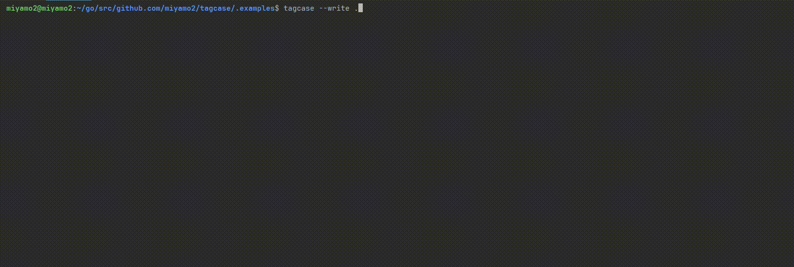
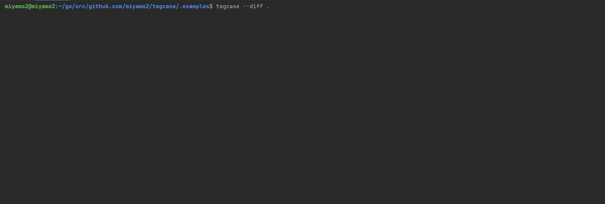
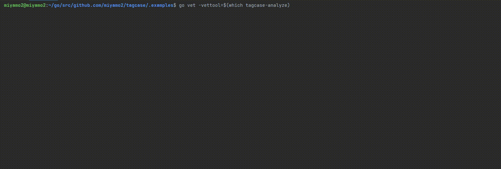
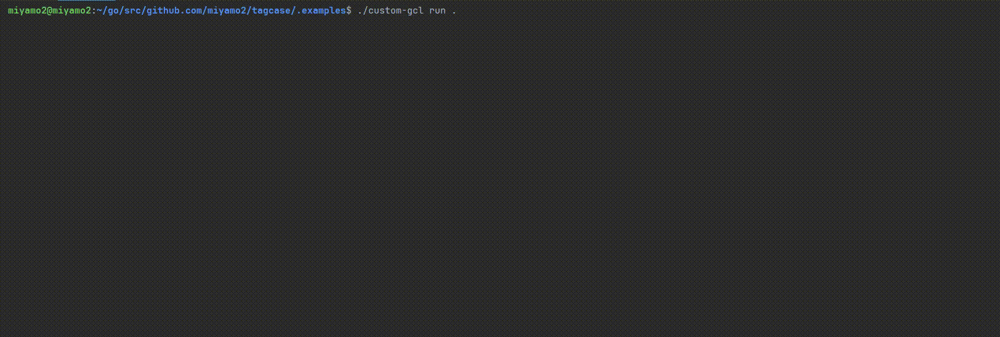

Goの構造体タグ(struct tag)が命名規則に沿っているかを静的解析/フォーマットする`tagcase`というツールを作りました  
スタンドアロンCLIの他にgo vet analyzer、golangci-lintプラグインを公開しているため、今回はそれぞれの使い方を紹介させてください

https://github.com/miyamo2/tagcase

## 使い方

### スタンドアロンCLI

```sh
go install github.com/miyamo2/tagcase@latest
```
Lintルールを記述した設定ファイル(.tagcase.yaml)が必要となるため`--init`フラグでボイラープレートを出力します

```sh
tagcase --init
```
**.tagcase.yaml**

```yaml
# yaml-language-server: $schema=https://raw.githubusercontent.com/miyamo2/tagcase/main/schema.json
# List of tags to check and their expected case.
tags:
  db:
    case: snake_case
  someother:
    # support: snake_case, camelCase, PascalCase, kebab-case, SNAKE_CASE, KEBAB-CASE
    case: camelCase
# List of initialisms to treat as special cases. default: See https://github.com/golang/lint/blob/83fdc39ff7b56453e3793356bcff3070b9b96445/lint.go#L770-L809
#initialism:
#  enable:
#    - BLAH
#  disable:
#    - ID
```

tagcaseの対象とするタグごとに`tags.<構造体タグ名>.case`を記述して命名規則を指定します   
caseに設定可能な文字列は以下の6通りです

- snake_case
- kebab-case
- camelCase
- PascalCase
- SNAKE_CASE
- KEBAB-CASE

`--write`フラグを使用することで命名規則に沿うようフォーマットすることができます

```sh
tagcase --write <対象のGoファイル>
```



また、`--diff`フラグでフォーマットを行わず、命名規則との差分を検知することも可能です

```sh
tagcase --diff <対象のGoファイル>
```



### go vet analyzer

```sh
go install github.com/miyamo2/tagcase/cmd/tagcase-analyzer@latest
```

スタンドアロンCLIと同様に .tagcase.yaml が必須となります  
ボイラープレートを生成するためにスタンドアロンCLIもあわせてインストールすると便利です  

```sh
go install github.com/miyamo2/tagcase@latest
tagcase --init
```

```sh
go vet -vettool=$(which tagcase-analyzer) ./...
```



### golangci-lintプラグイン

[Module Plugin System](https://golangci-lint.run/plugins/module-plugins/)を利用してgolangci-lintに組み込むことができます


**.custom-gcl.yml**
```yaml
version: v2.2.0
plugins:
  - module: 'github.com/miyamo2/tagcase'
    import: 'github.com/miyamo2/tagcase/pkg/golangci-lint/plugin'
    version: latest
```

```sh
golangci-lint custom
```

golangci-lintプラグインとして利用する場合は .tagcase.yaml は不要です  
代わりに golangci-lint の設定ファイル内にtagcaseのLintルールを記述する必要があります

**.golangci.yaml**

```yaml
version: "2"
linters:
  settings:
    custom:
      tagcase:
        type: "module"
        settings:
          # 以下 .tagcase.yaml と同様のスキーマ
          tags:
            db:
              case: snake_case
```


```sh
./custom-gcl run .
```

 
